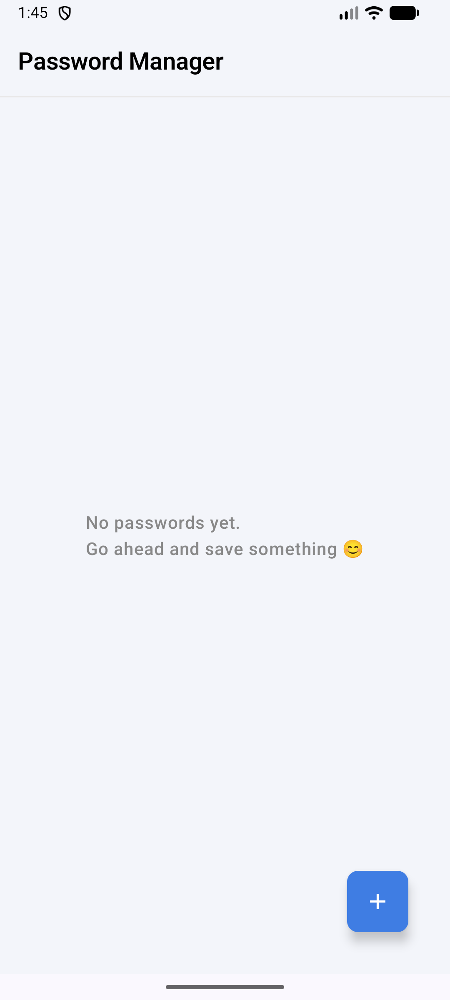
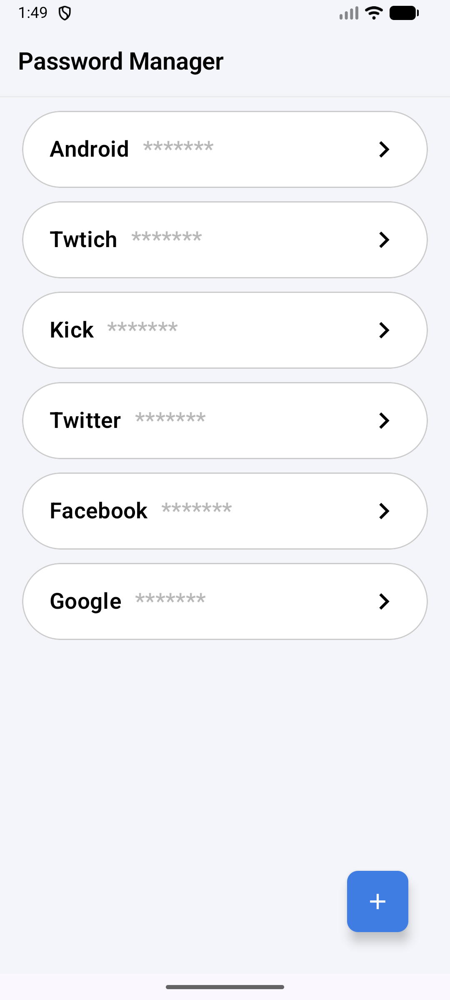
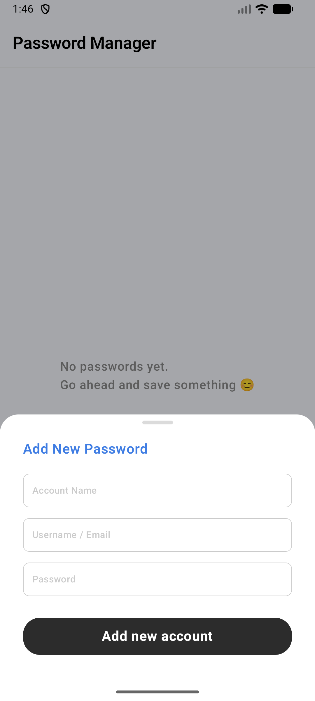
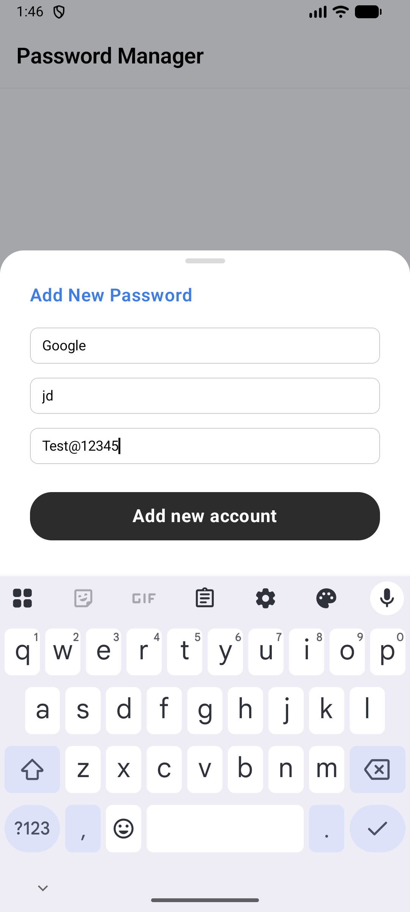
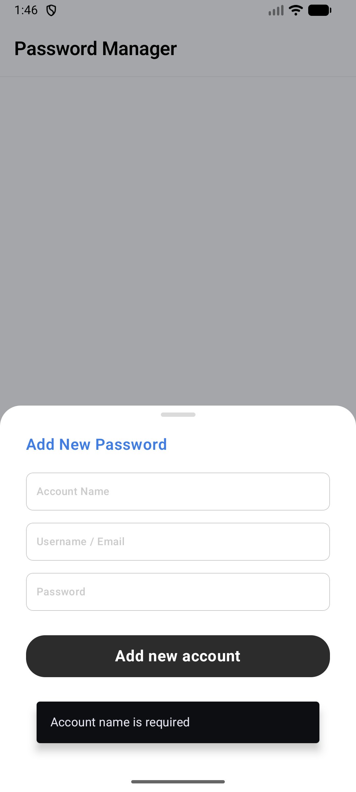
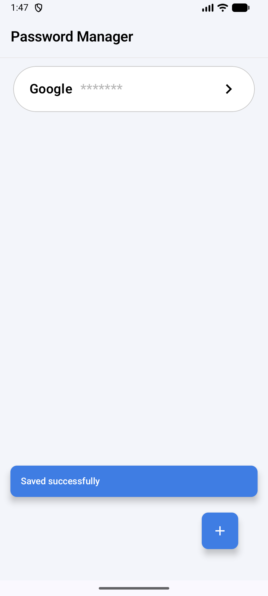

# Password Manager App 🔐

A secure and user-friendly password manager application built with Jetpack Compose for Android. This app allows users to store and manage their passwords in a secure and organized manner using industry-standard encryption.

## 📱 Demo

### Screenshots
<table>
  <tr>
    <td></td>
    <td></td>
    <td></td>
  </tr>
  <tr>
    <td align="center">Empty State</td>
    <td align="center">Password List</td>
    <td align="center">Add New Password</td>
  </tr>
  <tr>
    <td></td>
    <td></td>
    <td></td>
  </tr>
  <tr>
    <td align="center">Filled Form</td>
    <td align="center">Validation Error</td>
    <td align="center">Save Success</td>
  </tr>
</table>

### Video Demo
📹 [Watch App Demo](assets/app_screen_recording.webm)

### Download APK
📦 [Download APK](assets/APk/app-debug.apk)

## ✨ Features Implemented

### Core Functionality
- ✅ **Add Password**: Securely store new passwords with account type, username/email, and password
- ✅ **View/Edit Password**: View and modify existing password entries
- ✅ **Password List**: Home screen displays all saved passwords with essential details
- ✅ **Delete Password**: Remove unwanted password entries

### Security Features
- 🔒 **AES Encryption**: Passwords are encrypted using AES (Advanced Encryption Standard) algorithm
- 🗄️ **Local Database**: Secure local storage using Room database
- 🛡️ **Encrypted Storage**: All sensitive data is encrypted before storage

### User Experience
- ✅ **Input Validation**: Comprehensive validation for all mandatory fields
- ✅ **Error Handling**: Graceful error handling with user-friendly messages
- ✅ **Clean UI**: Intuitive interface following Material Design principles
- ✅ **Empty State**: Informative empty state when no passwords are saved

## 🏗️ Technical Implementation

### Architecture
- **Pattern**: MVVM (Model-View-ViewModel) architecture with Jetpack Compose
- **UI Framework**: Jetpack Compose (Modern Android UI toolkit)
- **Lifecycle**: Android Lifecycle Components for proper state management
- **Database**: Room Database for local data persistence
- **Encryption**: AES encryption for secure password storage

## 🙏 Acknowledgments

- Design reference: [Figma Design](https://www.figma.com/file/VYkl4ghM04eeaDcTpGo5hh/Password-Manager-App---Mobile-Team-Interview)
- Interview Task: MOBILEIIP02504.md [Chaintech Network](https://gist.github.com/dharmveersinh-ixfi/7a5eaac50ddb24853af9fbfcd878971f)